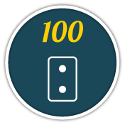
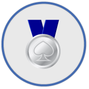
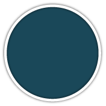
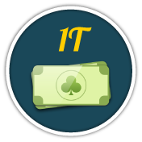

# Index

- [Smile](#smile)
- [Shirt](#shirt)
- [Frame](#frame)

# Auto-Index

- [Cheat](#cheat)
- [Draw](#draw)
- [Friend](#friend)
- [Lose](#lose)
- [Lucky](#lucky)
- [No](#no)
- [Points](#points)
- [Quad](#quad)
- [Rating](#rating)
- [Report](#report)
- [Streak](#streak)
- [Tour](#tour)
- [Win](#win)
- [Wins](#wins)

## Cheat

| **id**          | **name** | **icon**                                        |
|-----------------|----------|-------------------------------------------------|
| `cheat_success` |          |  |

## Draw

| **id**     | **name** | **icon**                                   |
|------------|----------|--------------------------------------------|
| `draw_1`   |          |    |
| `draw_10`  |          |   |
| `draw_100` |          |  |
| `draw_20`  |          |   |
| `draw_3`   |          |    |
| `draw_5`   |          |    |
| `draw_50`  |          |   |

## Frame

| **id**               | **name** | **icon**                                             |
|----------------------|----------|------------------------------------------------------|
| `frame_butterfly`    |          |     |
| `frame_chain`        |          |         |
| `frame_classic`      |          |       |
| `frame_feather`      |          |       |
| `frame_flower`       |          |        |
| `frame_fruitbraclet` |          |  |
| `frame_goldbars`     |          |      |
| `frame_heart`        |          |         |
| `frame_heart2`       |          |        |
| `frame_heartchain`   |          |    |
| `frame_knife`        |          |         |
| `frame_leafs`        |          |         |
| `frame_medal_bronze` |          |  |
| `frame_medal_gold`   |          |    |
| `frame_medal_silver` |          |  |
| `frame_nimb`         |          |          |
| `frame_rose`         |          |          |
| `frame_stars`        |          |         |
| `frame_wings`        |          |         |

## Friend

| **id**      | **name** | **icon**                                    |
|-------------|----------|---------------------------------------------|
| `friend_1`  |          |   |
| `friend_10` |          |  |
| `friend_20` |          |  |

## Lose

| **id**          | **name** | **icon**                                        |
|-----------------|----------|-------------------------------------------------|
| `lose_game_ace` |          |  |

## Lucky

| **id**  | **name** | **icon**                                |
|---------|----------|-----------------------------------------|
| `lucky` |          |  |

## No

| **id**       | **name** | **icon**                                     |
|--------------|----------|----------------------------------------------|
| `no_achieve` |          |  |

## Points

| **id**        | **name** | **icon**                                      |
|---------------|----------|-----------------------------------------------|
| `points_100b` |          |  |
| `points_100k` |          |  |
| `points_100m` |          |  |
| `points_10b`  |          |   |
| `points_10k`  |          |   |
| `points_10m`  |          |   |
| `points_1b`   |          |    |
| `points_1m`   |          |    |
| `points_1t`   |          |    |

## Quad

| **id** | **name** | **icon**                               |
|--------|----------|----------------------------------------|
| `quad` |          |  |

## Rating

| **id**        | **name** | **icon**                                      |
|---------------|----------|-----------------------------------------------|
| `rating_160k` |          |  |
| `rating_320k` |          |  |
| `rating_480k` |          |  |
| `rating_640k` |          |  |
| `rating_800k` |          |  |
| `rating_960k` |          |  |

## Report

| **id**           | **name** | **icon**                                         |
|------------------|----------|--------------------------------------------------|
| `report_cheater` |          |  |

## Shirt

| **id**            | **name** | **icon**                                          |
|-------------------|----------|---------------------------------------------------|
| `shirt_autumn`    |          |     |
| `shirt_bicycle`   |          |    |
| `shirt_buta`      |          |       |
| `shirt_classic`   |          |    |
| `shirt_durak_1`   |          |    |
| `shirt_gold`      |          |       |
| `shirt_greenblue` |          |  |
| `shirt_gzhel`     |          |      |
| `shirt_khokhloma` |          |  |
| `shirt_mehendi`   |          |    |
| `shirt_polynesia` |          |  |
| `shirt_redblue`   |          |    |
| `shirt_rstyle`    |          |     |
| `shirt_spider`    |          |     |
| `shirt_spring`    |          |     |
| `shirt_winter`    |          |     |
| `shirt_wolf`      |          |       |

## Smile

| **id**              | **name** | **icon**                                            |
|---------------------|----------|-----------------------------------------------------|
| `smile_bear`        |          |         |
| `smile_boar`        |          |         |
| `smile_bull`        |          |         |
| `smile_cat`         |          |          |
| `smile_classic`     |          |      |
| `smile_dog`         |          |          |
| `smile_dragon`      |          |       |
| `smile_elf`         |          |          |
| `smile_football`    |          |     |
| `smile_gnome`       |          |        |
| `smile_goat`        |          |         |
| `smile_g_blond`     |          |      |
| `smile_g_dark`      |          |       |
| `smile_g_glam`      |          |       |
| `smile_g_veil`      |          |       |
| `smile_hipster`     |          |      |
| `smile_hipstergirl` |          |  |
| `smile_hockey`      |          |       |
| `smile_horse`       |          |        |
| `smile_lion`        |          |         |
| `smile_monkey`      |          |       |
| `smile_m_blond`     |          |      |
| `smile_m_dark`      |          |       |
| `smile_m_long`      |          |       |
| `smile_panda`       |          |        |
| `smile_pumkin`      |          |       |
| `smile_rabbit`      |          |       |
| `smile_raccoon`     |          |      |
| `smile_rat`         |          |          |
| `smile_robot`       |          |        |
| `smile_rooster`     |          |      |
| `smile_santa`       |          |        |
| `smile_snake`       |          |        |
| `smile_snowman`     |          |      |
| `smile_spring`      |          |       |
| `smile_sun`         |          |          |
| `smile_suntan`      |          |       |
| `smile_tiger`       |          |        |
| `smile_unicorn`     |          |      |
| `smile_vampire`     |          |      |
| `smile_wolf`        |          |         |

## Streak

| **id**       | **name** | **icon**                                     |
|--------------|----------|----------------------------------------------|
| `streak_10`  |          |   |
| `streak_100` |          |  |
| `streak_20`  |          |   |
| `streak_3`   |          |    |
| `streak_5`   |          |    |
| `streak_50`  |          |   |
| `streak_7`   |          |    |

## Tour

| **id**            | **name** | **icon**                                          |
|-------------------|----------|---------------------------------------------------|
| `tour_bronze_1`   |          |    |
| `tour_bronze_10`  |          |   |
| `tour_bronze_100` |          |  |
| `tour_bronze_20`  |          |   |
| `tour_bronze_3`   |          |    |
| `tour_bronze_5`   |          |    |
| `tour_bronze_50`  |          |   |
| `tour_gold_1`     |          |      |
| `tour_gold_10`    |          |     |
| `tour_gold_100`   |          |    |
| `tour_gold_20`    |          |     |
| `tour_gold_3`     |          |      |
| `tour_gold_5`     |          |      |
| `tour_gold_50`    |          |     |
| `tour_silver_1`   |          |    |
| `tour_silver_10`  |          |   |
| `tour_silver_100` |          |  |
| `tour_silver_20`  |          |   |
| `tour_silver_3`   |          |    |
| `tour_silver_5`   |          |    |
| `tour_silver_50`  |          |   |

## Win

| **id**            | **name** | **icon**                                          |
|-------------------|----------|---------------------------------------------------|
| `win_pts_100`     |          |      |
| `win_pts_1000`    |          |     |
| `win_pts_10000`   |          |    |
| `win_pts_100000`  |          |   |
| `win_pts_1000000` |          |  |
| `win_pts_100b`    |          |     |
| `win_pts_100m`    |          |     |
| `win_pts_10b`     |          |      |
| `win_pts_10m`     |          |      |
| `win_pts_1b`      |          |       |
| `win_pts_1t`      |          |       |

## Wins

| **id**        | **name** | **icon**                                      |
|---------------|----------|-----------------------------------------------|
| `wins_100`    |          |     |
| `wins_1000`   |          |    |
| `wins_10000`  |          |   |
| `wins_100000` |          |  |
| `wins_250`    |          |     |
| `wins_2500`   |          |    |
| `wins_25000`  |          |   |
| `wins_500`    |          |     |
| `wins_5000`   |          |    |
| `wins_50000`  |          |   |

